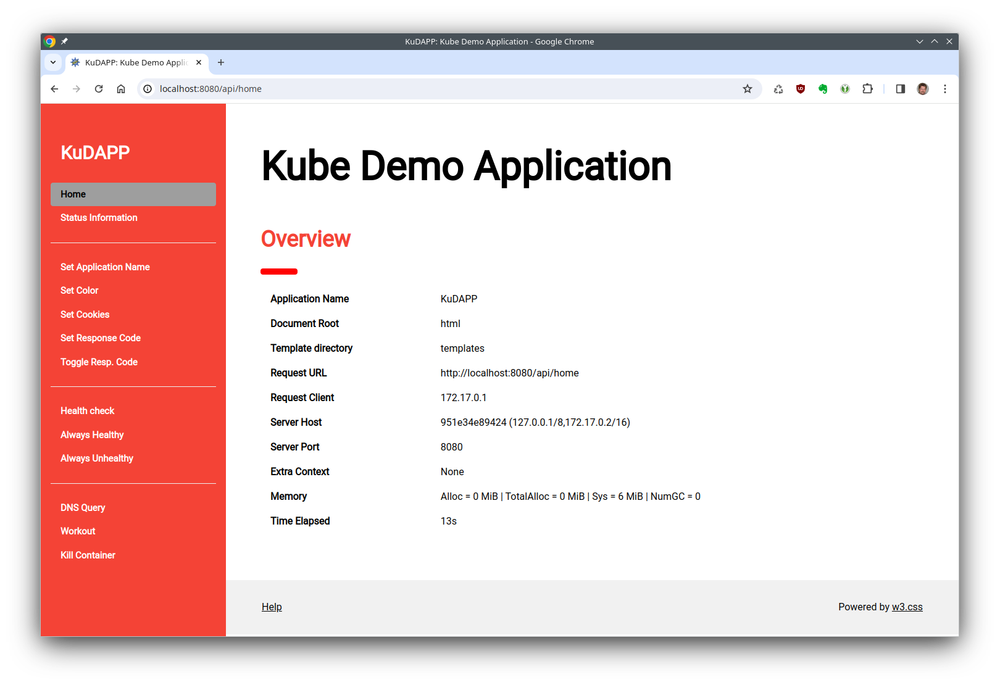

# **<u>Ku</u>bernetes <u>D</u>emo <u>App</u>lication: KuDAPP**

### Short Introduction

This is a little demo application for Kubernetes and Docker environments. It is intended for testing, debugging and learning about elements like services, ingresses, limits and health checks. KuDAPP is a simple and easy to deploy testing workload with an API and an integrated little web server. It is particularly suitable as a backend behind an ingress or a reverse proxy and shows some information about the container, its environment and the request header as seen from the inside. It can generate some load and kill itself, so it is possible to test things like CPU limits, container health checks and replication controllers in a Kubernetes environment. You can use it anywhere you need a simple application that responds to HTTP requests. 

KuDAPP is heavily inspired by **KUARD** - the [**Demo application for "Kubernetes Up and Running**](https://github.com/kubernetes-up-and-running/kuard). Of course, the original KUARD has a ton of additional features, but there is one feature I have always missed: the ability to set an arbitrary context path prefix like /foo/bar/home or /extra/context/home, so a demo application can be mounted on the sub path of an ingress without tinkering with request or response headers. That's why I started to write my own 'KUARD'. 



### Features:

After start up, an instance provides the following URLs (with optional prefix):

- **Startpage: \[/prefix\]/api/home**
  Displays the startpage with a short information summary
  
- **Server Status: \[/prefix\]/api/status**
  Get some information as seen from 'inside'. This includes all request headers, some system information and all environment variables in the running container
  
- **Set Appl. Name:  \[/prefix\]/api/setname**
  Change the application name.
  
- **Set Color:  \[/prefix\]/api/setcolor**
  Play with background colors. This may help to distinguish several instances in a pool or backend
- **Set Status Code: \[/prefix\]/api/setstatus**
  Set the HTTP response status code to a certain value. This is the value returned by the /check URL
  
- **Toggle Status: \[/prefix\]/api/togglestatus**
  Switch the response status code between 200 and 500. This is a shortcut for setting an individual value
  
- **Health Check: \[/prefix\]/check**
  Get the current response status code (default: 200). Can be set with "Set Status Code" (see above)
  
- **Always Healthy: \[/prefix\]/check/healthy**
  Always return a response status code of 200
  
- **Always Unhealthy: \[/prefix\]/check/unhealthy**
  Always return a response status code of 500
- **Workout: \[/prefix\]/api/workout**
Starts and stops the dummy workout to produce system load
- **Kill Container: \[/prefix\]/api/kill**
Kills the process (and therefore the container) immediately

Additionally, any static file (e.g. "foo.html") inside the document root (default: the "html"-directory) will be served as "/foo.html". You also may create subdirectories there, as long as the path does not conflict with the URLs above. Do not remove the css components there. 


### The Workout

If you have the need to debug or examine cpu limit settings or testing the configuration of monitoring or metrics, KuDAPP provides a dummy system load generator. Behind the scenes, each worker produces very, very big fibonacci numbers and forgets it right away. This is of course completely pointless, but this way each worker produces a [CPU load](https://docs.kernel.org/admin-guide/cpu-load.html) close to 100%. This should be noticeable on the node and in the cluster metrics. 

When using this feature, please make sure that you use an ingress with *session stickiness* or have only one instance configured for an URL. When your ingress uses e.g. *round robin* on its balancer pool, it is difficult to operate the workout, because the api call on /api/workout needs some form actions on itself. This is nearly impossible without sticky sessions.   

**Please be very careful with this!** 

This really is a debugging and testing feature. If you run your container workloads somewhere other than on your development system, **there really is the chance that this will generate costs!** Therefore, the running time of the workers is limited to 5 minutes.  

## Runtime configuration

#### Environment Variables and Command Line Options:

The application reads some settings from the environment, command line options or a configuration file. The default variable prefix is "KUDAPP". This can be changed to another value by the command line option `--environment-prefix prefix` or the configuration setting `EnvironmentPrefix: prefix` in a configuration file.

For a full list of command line options, execute the application or an enclosing container with `--help`: 

```shell
# Executable:
$ ./kudapp --help
# Container:
$ docker run -it --rm 'IMAGE:TAG' --help
```


**The most important environment vars | command line options are:**

- KUDAPP_SERVERPORT=port | `-p, --port port`:
  Sets the listening port to `port` (default: 8080)
- KUDAPP_DEFAULTCOLOR=color | `--default-color color`:
  Sets the background color of the application (default: red)
- KUDAPP_CONTEXTPREFIX=prefix | `--context prefix`:
  Sets a context prefix. If set to "/foo", all links are modified with this prefix, e.g. from "/api/home/" to "/foo/api/home"
- KUDAPP_APPLICATIONNAME=name | `-N, --app-name name`:
  Sets the application name. Default: "KuDAPP"
- KUDAPP_TEMPLATEDIR | `-T, --template-dir path`: 
  Set the template directory to "path". Default: ./templates
- KUDAPP_DOCUMENTROOT | `-D, --document-root path`:
  Set the document root to "path". Default: ./html
- KUDAPP_CREATEINDEX=1 | `--create-index`:
  If set, the app creates a simple index file to redirect from the context url "/context" to the start page "/context/api/home" at startup
- KUDAPP_VERBOSE=1 | `-v, --verbose`:
  Enables a more verbose logging to stdout


#### Example Configuration File (YAML):

```yaml
AsciiMode: false
Verbose: false
CreateIndex: false
NoColor: false
ApplicationName: Kudapp
ContextPrefix: /
DefaultColor: red
EnvironmentPrefix: KUDAPP
ServerPort: "8080"
DocumentRoot: ./html
TemplateDir: ./templates
```

The default locations for the configuration file are displayed with "--help" (see above). In the prebuild image, "/opt/kudapp/config.yml" is a good choice. 


## Building

KuDAPP is written in pure [Go](https://go.dev/), so you need a working Go installation. To help you setting up a Go compiler on your platform, please visit the [Get Started](https://go.dev/learn/) area on the Go website. If you installed the compiler successfully, the following command should produce an output like this:

```Shell
$ go version 
go version go1.21.5 linux/amd64
```

If you intend to build your own container images, it is recommended to create a static binary to avoid problems with missing shared libs or their versions. To do so, set the environment variable CGO_ENABLED=0.

It is also recommended to keep your sources secure by using [govulncheck](https://pkg.go.dev/golang.org/x/vuln/cmd/govulncheck). You can install it easily by 

```shell
$ go install golang.org/x/vuln/cmd/govulncheck@latest
```

 There also is a [security best practices guide](https://go.dev/security/best-practices) you may be interested in.

#### Create the Executable:

```shell
$ git clone https://gitlab.test.dwinternal.com/hleinders/kudapp.git
$ cd kudapp
$ go mod tidy
$ go vet ./...
$ govulncheck ./...
$ CGO_ENABLED=0 go build -o kudapp
```

As a shortcut, you may use the little script `compile.sh`

#### Run the Executable:

The executable is a self contained, statically linked binary if compiled with CGO_ENABLED=0. But to be functional, it needs the templates directory and the document root. It searches for these two folders in the current directory by default, but you can set their locations with the environment vars KUDAPP_TEMPLATEDIR and KUDAPP_DOCUMENTROOT or the corresponding command line options. Do not remove or rename the files in these two directories as long as you do not want to modify the code.

To get a full help, simply run

```SHELL
$ ./kudapp --help
```

You can start up the application in the current directory (containing "templates" and "html") by

```shell
$ ./kudapp -v
```

Then you can access the application at http://localhost:8080


## Create Images

To build your own container images, you may create a Dockerfile of your choice or use the one in the repo ("./Dockerfile"). Please note that the directories "html" and "templates" are needed, so build the images in the main directory where the Dockerfile is located and, of course, build the executable first. 

You may find the little script "build.sh" useful. If you have your own private registry, you can set the environment variable "CONTAINER_REGISTRY" prior to running the script. In any case, no images are pushed automatically to prevent any accidental overwrite of an image.

To build the demo images for "red", "blue" "green" and "latest" for a registry called "my.registry.io", simply run

```shell
$ CONTAINER_REGISTRY="my.registry.io" ./build.sh
```

The images are created with the KuDAPP executable as ENTRYPOINT, so all arguments on the command line are passed to KuDAPP, for example:

```shell
$ docker run -it --rm 'IMAGE:TAG' --help
$ docker run -d --rm 'IMAGE:TAG' --verbose --context "/foo/bar"
```


## Usage
You can use the executable directly, as described above, or in any environment using containers you want to debug or examine.

 

#### Local demo (docker)

To set up a local demo using docker, please compile and build the images to your local docker registry and then change your location to "demo", where you find a usable **docker-compose.yml**.

This creates a docker stack containing three demo instances "red", "green" and "blue" and an ingress  ([Traefik](https://traefik.io/traefik/)), running on port 80.  A working *docker compose* is required, either as single executable or as docker plugin.

So, just execute the following commands:

```shell
$ ./compile.sh
$ ./build.sh
$ cd demo
$ docker compose up -d && docker compose logs -f
```

After this, you can access the instances by their "color", e.g. http://localhost/red .


#### Deploy to a Kubernetes environment

The setup of a Kubernetes environment is definitely beyond the scope of this document. You need access to a working cluster and the access rights to write to a namespace. 

In the folder "manifests" you can find a set of files you may use as starting point to deploy KuDAPP to your environment. At least you have to edit the image repository, the access secret for the registry and the namespace you want to use. Additionally, there is a little nginx frontend as entry point for "/". You have to create an image first, **Dockerfile.nginx** is intended for that purpose.

The main reason for writing this application is the possibility to configure a context prefix, e.g. "/foo". If the instance is started with KUDAPP_CONTEXTPREFIX="/foo", it allows KuDAPP to be configured as the sub path of an an ingress like

```yaml
  - backend:
      service:
        name: kudapp-foo-svc
        port:
          number: 8080
    path: /foo
    pathType: Prefix
```

Without this feature it is pretty ugly to match and convert requests for "/foo/api/home" to "/api/home" and vice versa, including sub requests for css files or the like.


## Authors and acknowledgment

This application is heavily inspired by [KUARD](https://github.com/kubernetes-up-and-running/kuard). Thanks for this great work.

KuDAPP makes use of "[Viper](https://github.com/spf13/viper)" by Steve Francia (spf13) and "[Colors](https://github.com/fatih/color)" by Fatih Arslan (fatih).

The pages are build with [w3.css](https://www.w3schools.com/w3css/default.asp) by [w3Schools](https://www.w3schools.com/). The Google font "[Roboto](https://github.com/googlefonts/roboto/)" is embedded via CSS and a local copy of roboto.ttf. 


## License

This application is licensed under GNU GPLv3.


